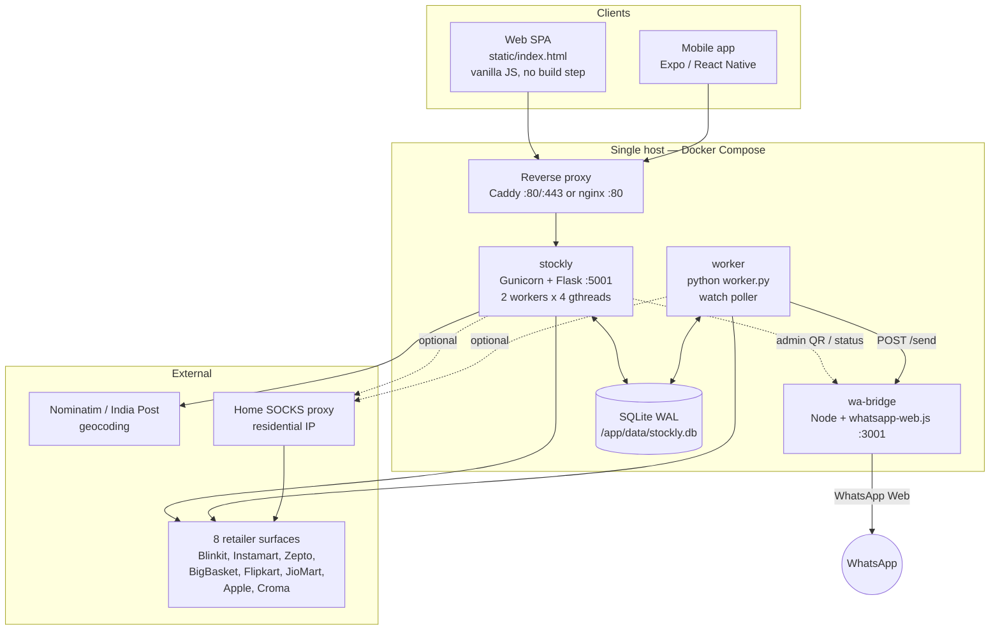
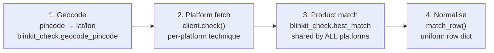
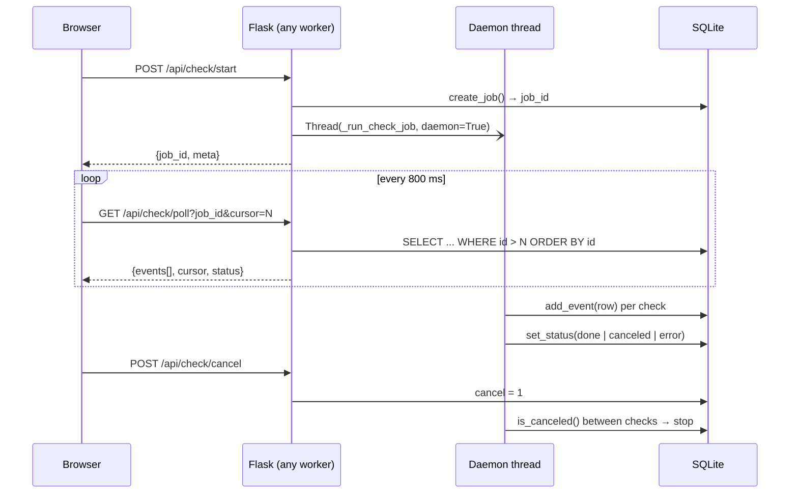
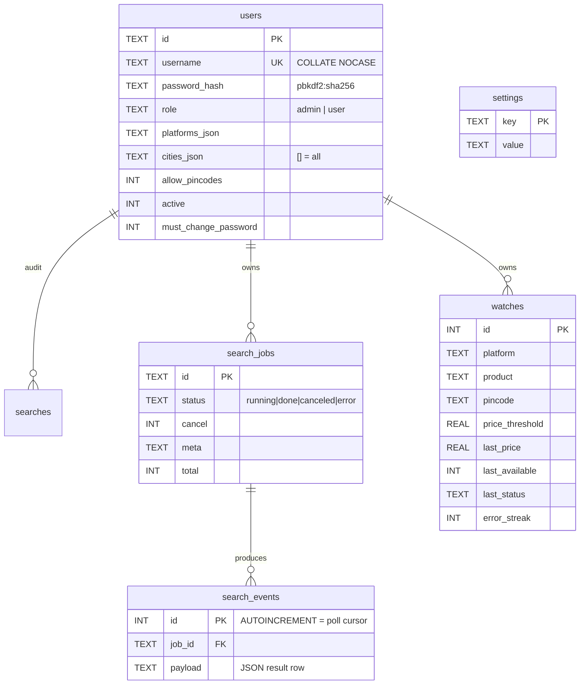
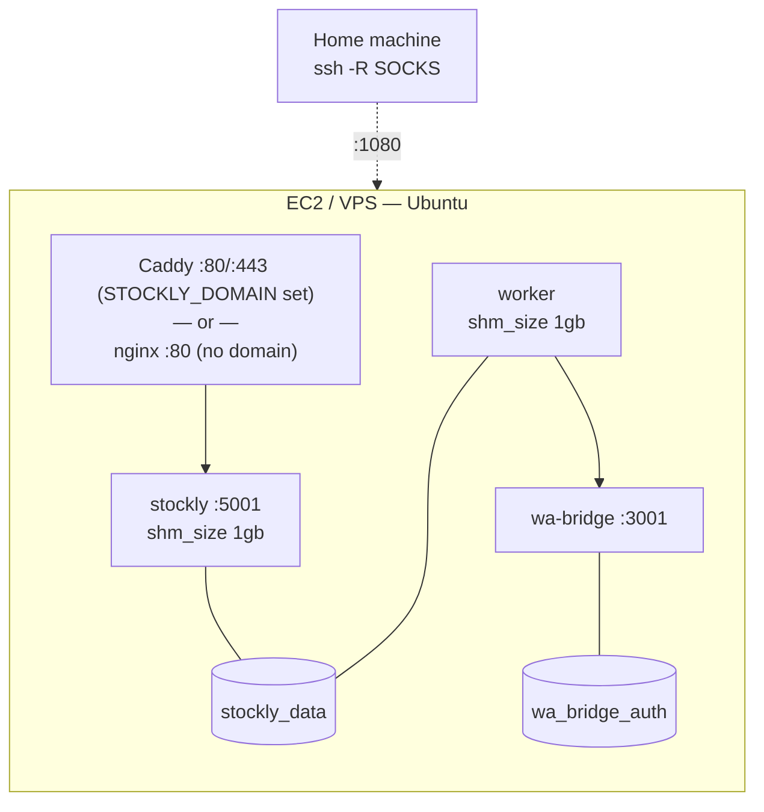

# Stockly (Stockify) — Architecture

> Multi-platform, multi-location product availability checker for the Indian
> retail market, with background stock watches and WhatsApp alerting.

**Status of this document:** describes the application as committed at `HEAD`
(`6a159f2`). See [§12 Working-tree divergence](#12-working-tree-divergence-important)
— the current checkout is *not* a runnable state.

**Audience:** engineers. For the non-technical view — features, users, coverage,
capacity and running costs — see [`PRODUCT_OVERVIEW.md`](./PRODUCT_OVERVIEW.md).

---

## 1. What the system does

A user asks one question: **"is this product actually buyable near me, right now?"**

Answering it is hard because there is no single source of truth. Each retailer
exposes availability only through its own consumer surface, gated on a delivery
location, and each actively defends that surface against automation. Stockly's
whole reason to exist is to normalise those eight incompatible, hostile surfaces
into one uniform answer.

Two usage modes:

| Mode | Trigger | Path | Result |
|---|---|---|---|
| **On-demand search** | User clicks "Check" | Web/mobile → background job → poll | Table of rows streamed in as they complete |
| **Watch** | User registers a product+pincode | `worker` process polls on a cadence | WhatsApp message on a state change |

The unit of work in both modes is identical and is the core domain concept:

> **A check = (platform × product query × pincode) → normalised availability row.**

A search for 3 products across a city with 50 pincodes on all 8 platforms is
`3 × 50 × 8 = 1,200` checks. This fan-out, multiplied by scrapers that take
seconds each and must be rate-limited, is the dominant force shaping the
architecture. Almost every design decision below follows from it.

---

## 2. Context and containers



### Container responsibilities

| Container | Tech | Owns | Scaling |
|---|---|---|---|
| `stockly` | Playwright-Python image, Gunicorn `gthread` | HTTP API, auth, job orchestration, static SPA | 2 procs × 4 threads |
| `worker` | Same image, `python worker.py` | Watch scheduling, change detection, alert dispatch | Exactly 1 |
| `wa-bridge` | Node 20, `whatsapp-web.js`, Puppeteer | WhatsApp Web session, QR pairing, send | Exactly 1 (stateful) |
| Proxy | Caddy or nginx | TLS, buffering-off passthrough | 1 |

`stockly` and `worker` are **the same image with different entrypoints**. That
is deliberate: both need the identical scraper stack (Chromium, `curl_cffi`,
matching logic), so one build artefact serves both and there is zero chance of
the two paths drifting in behaviour.

`worker` is a **separate process rather than a thread in the web app** because
Playwright drives Chromium subprocesses. Forking those under a Gunicorn worker
that recycles (`max_requests = 500`) would orphan browsers and leak memory.
Isolation buys a clean, independently restartable lifecycle.

---

## 3. The scraper abstraction — the heart of the system

The eight `*_check.py` modules are where essentially all domain complexity
lives (~2,700 lines). They present a **duck-typed contract** rather than an ABC:

```python
client.check(lat, lon, query[, pincode]) -> dict   # raw, platform-shaped
match_row(query, result)                 -> dict   # normalised row
```

Blinkit is the one exception (function-based: `blinkit_search()` + inline
normalisation in `app.py`), a legacy of it being the original platform.

### Four-layer pipeline

Every check flows through the same four stages regardless of platform:



Two shared pieces are worth calling out, because they are the actual
abstraction:

- **`geocode_pincode`** is the single entry to location. Nominatim with an
  India Post fallback, memoised to `data/pincode_geocache.json`. All eight
  platforms consume its output, so location semantics stay consistent.
- **`best_match(query, products)`** lives in `blinkit_check.py` and is imported
  by *every* other module. It is accessory-aware (so "iphone 17" does not match
  an iPhone 17 case), capacity-aware (prefers matching storage tiers) and
  tolerates both stock-field spellings (`available` for Blinkit, `inStock` for
  the rest). Free-text matching is the system's fuzziest link, and centralising
  it means one fix improves all platforms at once.

### The uniform output row

Every platform, whatever its internal shape, resolves to:

```json
{
  "type": "result", "index": 1, "seq": 42,
  "pincode": "560001", "platform": "blinkit",
  "location": "Bengaluru...", "lat": 12.97, "lon": 77.59,
  "product": "amul milk",
  "status": "available | out_of_stock | not_found | not_serviceable | geocode_failed | error | error_<code>",
  "available": "yes | no | \"\"",
  "name": "", "variant": "", "brand": "",
  "price": null, "mrp": null, "inventory": "", "eta": "", "merchant_id": "",
  "detail": "only present on error"
}
```

The `status` enum is the contract's most important element. Note it
distinguishes four genuinely different negative outcomes — **out of stock**
(product exists, unavailable), **not found** (no match for the query),
**not serviceable** (platform does not deliver here) and **error** (we failed).
Collapsing these into a boolean would destroy the product's value; a watch must
never alert on "we couldn't check" (see [§7](#7-watches-and-alerting)).

### Per-platform technique

There is no common transport, because each retailer defends differently. The
technique chosen per platform is a direct response to its specific defence:

| Platform | Transport | Location mechanism | Stock signal |
|---|---|---|---|
| Blinkit | `curl_cffi` JSON API, `chrome124` TLS impersonation | `lat`/`lon` HTTP headers | `!is_sold_out && inventory > 0` |
| Instamart | **Hybrid**: Playwright primes AWS WAF, then `curl_cffi` `chrome142` for search | `lat`/`lng` query params → `storeId` | `inStock` boolean |
| Zepto | Playwright, DOM scrape | `latitude`/`longitude`/`user_position` cookies | "Add" button present && no OOS text |
| BigBasket | `curl_cffi` JSON API | Base64 cookies `_bb_lat_long`, `_bb_addressinfo` | `avail_status == "001"` |
| Flipkart | Playwright, DOM scrape | Spoofed GPS geolocation permission | "Add" && no OOS text |
| JioMart | Playwright, DOM scrape | Spoofed GPS + `app_geolocation` cookie | "Add" && no OOS text |
| Croma | Playwright (**real Chrome channel**), in-page `fetch` to JSON | Pincode → TMS availability POST | `HDEL` fulfilment line |
| Apple | Playwright (**real Chrome channel**), in-page `fetch` | Pincode → `fulfillment-messages` | `deliveryEligible \|\| pickup.available` |

Three escalating tiers of evasion are visible, and the progression is the
interesting part:

1. **TLS fingerprint impersonation** (`curl_cffi`) — cheapest and fastest, used
   wherever a plain JSON API exists. No browser, ~1s per check.
2. **Headless Chromium** (Playwright) — needed when availability is only
   rendered client-side, or when the API demands a real browser session.
3. **Real Chrome channel + stealth patches** — Akamai (Croma, Apple) detects
   bundled headless Chromium and returns HTTP 541, so these require the actual
   Chrome binary plus `navigator.webdriver` masking.

Instamart is the most instructive case and shows the tiers are not mutually
exclusive. Its search endpoint sits behind a CloudFront limiter literally named
`JA4-ratelimit-instamart`, which fingerprints the TLS handshake. A headless
browser gets 403s; so the code uses Playwright *only* to solve the WAF
challenge and harvest cookies, then replays those cookies over `curl_cffi` with
a different TLS fingerprint to actually search. That hybrid is not accidental
complexity — it is the only combination that works.

---

## 4. Execution model — jobs, not streams

The most significant architectural decision in the codebase is that on-demand
searches are **persisted background jobs polled by a cursor**, not HTTP streams.

### Why it changed

The original design streamed NDJSON directly from `POST /api/check`. That
coupled run lifetime to connection lifetime, and a 1,200-check run takes
several minutes. Any mobile backgrounding, network blip, tab suspend or reload
lost the entire run. The mobile client still uses this legacy path.

### Current design



Four properties fall out of this, and each solves a concrete failure that the
streaming design could not:

- **Durability** — the run lives in SQLite, not in a socket. Close the laptop,
  reopen, resume from `localStorage['stockly_active_job']`.
- **Monotonic cursor** — `search_events.id` (AUTOINCREMENT) is the `seq`.
  Polling is `WHERE id > cursor`, which makes ingestion **idempotent**. This is
  what makes overlapping polls (triggered by `visibilitychange`, `focus` and
  `pageshow` firing together) safe; commit `00d7539` fixed duplicate rows
  exactly here.
- **Cooperative cancellation** — `Stop` sets a flag; the worker thread checks it
  between *every* platform, not just between pincodes (commit `d882ea0`), so a
  stop is felt within one check rather than one full platform sweep.
- **Worker-agnostic reads** — because state is in shared SQLite, the poll can be
  served by a different Gunicorn process than the one running the job.

### Concurrency, precisely

This is subtle and worth stating explicitly, because it bounds throughput:

- Gunicorn runs **2 processes × 4 threads** (`gthread`).
- Each scraper client is a **module-level singleton guarding `check()` with a
  `threading.Lock`** — verified in all seven class-based modules.
- Therefore **within one process, checks against a given platform serialise**.
  Two processes → at most 2 concurrent Instamart checks, each with its own
  Chromium instance.

The lock is not a bottleneck to remove — it is load-bearing. It protects a
single shared browser context per platform and doubles as politeness rate
limiting. Removing it would multiply Chromium memory and trip the very rate
limiters the scrapers work so hard to dodge.

---

## 5. Data model

One SQLite file, WAL mode, `timeout=30`, `check_same_thread=False`, shared by
the web container and the worker container over a Docker volume.



`watches` carries `UNIQUE(user_id, platform, product, pincode)`, making
registration idempotent — re-adding an existing watch upserts instead of
duplicating.

**Schema management is `CREATE TABLE IF NOT EXISTS` plus guarded
`ALTER TABLE`** in each module's `init_db()`, invoked at import time from
`app.py`. There is no migration framework and no version table. This is
appropriate at current scale but is the first thing that will need to change
(see [§11](#11-risks-and-recommendations)).

### Why SQLite is the right call here

Concurrent writers are: N job threads plus one worker process. WAL permits one
writer with concurrent readers, and write volume is trivially low — one row per
check, where each check takes seconds. The database is nowhere near being the
bottleneck; the retailers are. Introducing Postgres would add an operational
component without relieving any real constraint.

---

## 6. Security model

**Authentication** is server-side Flask sessions in a signed cookie
(`stockly_session`), `HttpOnly`, `SameSite=Lax`, `Secure` in production.
Passwords use Werkzeug `pbkdf2:sha256`. No JWTs, no client-side token storage —
the mobile app deliberately relies on React Native's native cookie jar rather
than managing tokens.

**Authorisation is a three-dimensional grant model**, which is unusual and is
the security design's most notable feature:

| Dimension | Column | Semantics |
|---|---|---|
| Platform | `platforms_json` | Per-platform boolean map |
| City | `cities_json` | Allow-list; `[]` means unrestricted |
| Free pincodes | `allow_pincodes` | May the user type arbitrary pincodes? |

The third exists because pincodes are the cost driver. A user granted one city
is bounded; a user who can paste arbitrary pincodes can trigger unbounded
scraping. This is quota control expressed as authorisation.

Critically, **enforcement is server-side re-filtering, not client trust**.
`/api/check/start`, `/api/product-options` and `/api/watches` each independently
intersect the request against the caller's grants *before* resolving pincodes:

From `check_start()` in `app.py` at HEAD (line 607; the pattern repeats
verbatim at lines 728 and 813 for the other two entry points):

```python
    allowed_city_ids = auth.allowed_cities(user)  # None == unrestricted
    if allowed_city_ids is not None:
        payload["cities"] = [
            c for c in req_cities
            if str(c).strip().lower().replace(" ", "-") in allowed_city_ids
        ]
    if not auth.can_use_pincodes(user):
        payload["pincodes"] = []
```

Other safeguards: forced password change on first login gates every route
except `/api/me`, `/api/logout`, `/api/change-password`; the last active admin
cannot be demoted, disabled or deleted; all searches are audited to `searches`.

Gaps: no CSRF tokens (mitigated but not eliminated by `SameSite=Lax`), no login
rate limiting or lockout, no self-service registration (admin-provisioned only,
which is a reasonable choice for this system's scale).

---

## 7. Watches and alerting

`worker.py` is a single-threaded loop, intentionally simple:

```
every WATCH_TICK_SEC (60s):
    due = watches.due_watches(interval_min, WATCH_BATCH=40)
    for each watch:
        _throttle(platform)          # per-platform minimum spacing
        result = _check_platform(...)
        decide, record, maybe notify
        sleep(WATCH_PAUSE_SEC + random(0..JITTER))
```

Three defensive mechanisms shape it, and all three are about not getting
blocked:

- **Batch cap (`WATCH_BATCH = 40`)** — bounds any single cycle so a large watch
  list cannot stampede the retailers.
- **Jittered pauses** — cadence-based rate limiters are easier to trip with
  clockwork-regular traffic, so randomness is added deliberately.
- **Per-platform spacing** — `PLATFORM_MIN_INTERVAL_SEC` sets Instamart to 12s
  ± 6s jitter; other platforms are unthrottled. Targeted, not blanket.

### Alert decision

Four modes, resolved from the `settings` table with env fallback:

| Mode | Fires when | Dedupe |
|---|---|---|
| `threshold` | In stock **and** `price <= price_threshold` | Only on *entering* the state (`met && !prev_met`) |
| `price_drop` | In stock **and** `price < last_price` | Re-fires on each new drop |
| `availability` | Transitions out-of-stock → in-stock | `new && !prev` |
| `change` | Any status change | Every change |

The unifying principle is **edge-triggered, not level-triggered**: alerts fire
on transitions, so a product sitting in stock for a week produces one message,
not one per poll cycle.

### Transient-error isolation

The most important correctness property in the watch pipeline:

```python
TRANSIENT = {"error", "geocode_failed", ""}
```

A WAF challenge, network failure or geocode miss increments `error_streak` and
**does not overwrite `last_status` or `last_price`**. Without this, a single
Instamart 403 would look like "out of stock", and recovery on the next cycle
would look like "back in stock" — firing a false alert. Given scrapers fail
routinely by design, conflating "unknown" with "unavailable" would make the
alerting untrustworthy. This is why the `status` enum in [§3](#3-the-scraper-abstraction--the-heart-of-the-system)
keeps errors distinct from out-of-stock.

### Delivery

`whatsapp.py` is a strategy selector over four providers: `webjs` (self-hosted
bridge), `callmebot`, `meta` (Cloud API), `none` (log only). Default is
`callmebot`; the production stack uses `webjs`.

`wa-bridge` is a Node sidecar wrapping `whatsapp-web.js`, exposing
`GET /health`, `GET /status`, `GET /qr`, `POST /send`, `POST /logout`, with
optional `X-Auth-Token`. It is stateful — the WhatsApp Web session persists to
`wa_bridge_auth:/data/.wwebjs_auth` — and pairing happens by an admin scanning
a QR proxied through `/api/admin/whatsapp/qr`. It clears stale Chromium
`Singleton*` locks on init (commit `4a1abc8`), a scar from container restarts
leaving lockfiles behind.

Isolating WhatsApp in a Node process is the right boundary: `whatsapp-web.js`
is the mature client for this, it owns a long-lived Puppeteer session, and a
crash there must not take down the API.

---

## 8. Anti-bot strategy as a first-class concern

Most systems treat network egress as an implementation detail. Here it is an
architectural constraint, and it shapes deployment topology.

**Grocery platforms block datacenter IP ranges.** Deployed on EC2, Instamart and
Zepto return 403s or login walls regardless of how good the scraper is. No
amount of TLS impersonation fixes an IP-reputation block.

Two mitigations exist, both funnelled through `config.PROXY_SERVER` and exposed
to scrapers as `playwright_proxy()` / `curl_proxies()` so no scraper knows
where its egress comes from:

1. **Commercial residential proxy** — set `STOCKLY_PROXY_SERVER`.
2. **Home SSH reverse tunnel** — the DIY option, and a genuinely clever one:

```
[Home machine]  ssh -N -R 0.0.0.0:1080  →  [EC2 host: SOCKS :1080]
                                                    ▲
[stockly / worker containers] ──socks5://host.docker.internal:1080──┘
                                                    │
                                          egress via residential IP
```

`deploy/home-proxy.sh` maintains this with a 5s reconnect loop. Containers reach
the host-bound listener via `extra_hosts: host.docker.internal:host-gateway`.
It trades a paid proxy for a dependency on a machine at home staying online —
an explicit, sensible cost decision for a personal-scale system.

---

## 9. Deployment topology



Two compose files, selected by whether `STOCKLY_DOMAIN` is set:

| | `docker-compose.yml` | `docker-compose.caddy.yml` |
|---|---|---|
| Edge | nginx `:80` | Caddy `:80` + `:443` |
| TLS | none | automatic Let's Encrypt |
| Chosen when | no domain | `STOCKLY_DOMAIN` set |

Both proxies are configured for **long-lived unbuffered responses** —
`proxy_buffering off` in nginx, `flush_interval -1` with 600s timeouts in
Caddy. That is a holdover from the NDJSON streaming era which the mobile client
still depends on; the web SPA's polling model no longer needs it.

Provisioning is `deploy/ec2-bootstrap.sh` (creates 2GB swap — Chromium is
memory-hungry — installs Docker, generates `.env` with random secret and admin
password, brings the stack up, polls `/api/health`), pushed from a workstation
by `deploy/deploy-to-ec2.sh` over SSH.

---

## 10. Request lifecycle, end to end

Tracing a single search makes the layering concrete:

1. **Browser** → `POST /api/check/start` with platform, cities, pincodes, products.
2. **Authz** — `login_required`, then platform/city/pincode grants re-filtered server-side.
3. **Resolution** — cities expand to pincode lists from `cities.json`;
   `parse_products_with_thresholds` splits an inline `@14300` target price;
   `total = |pincodes| × |products| × |platforms|`.
4. **Audit** — one row into `searches`.
5. **Dispatch** — `jobs.create_job()`, then a daemon thread; respond immediately
   with `{job_id, meta}`.
6. **Execution** (background) — optionally reorder pincodes nearest-first via
   `_order_pincodes_by_distance` (cache-only Haversine, no blocking network
   calls, so the run starts instantly); then for each pincode → geocode → for
   each product → for each platform → `_check_one()` → `jobs.add_event()`,
   checking the cancel flag at every level.
7. **Polling** — client polls every 800ms with its cursor; rows dedupe on `seq`;
   status flips to `done` / `canceled` / `error`.

The nearest-first ordering deserves note: it uses **only already-cached
geocodes**, leaving uncached pincodes in their original position at the end.
It accepts imperfect ordering on a cold cache in exchange for zero startup
latency, and self-corrects on the next run. That is a good latency/quality
trade, and it is documented in the code as such.

---

## 11. Risks and recommendations

Ordered by severity. Items 1–3 are real defects, not stylistic concerns.

**1. Jobs are lost on Gunicorn worker recycle.** `max_requests = 500` recycles a
worker after 500 requests. The web SPA polls every 800ms — roughly 75 requests
per minute per active client. A worker therefore recycles every ~7 minutes of
sustained polling, and any daemon thread running a job inside it is killed. The
job row stays `running` forever because nothing detects the death.
*Fix:* raise or disable `max_requests`, and add a heartbeat/lease column so a
stale `running` job can be reaped or resumed.

**2. No job liveness detection.** Independent of recycling — a crashed thread,
OOM kill or container restart leaves jobs permanently `running`. Clients poll
indefinitely. *Fix:* record `updated_at` per event and treat a job with no
progress beyond a threshold as `error`.

**3. Job execution is coupled to the web tier.** Search jobs run as threads
inside Gunicorn while watch checks run in a dedicated process, despite both
being the same CPU/memory-heavy Chromium workload. This makes web-tier capacity
a function of scraping load, and is the root cause of items 1 and 2. *Fix:*
move job execution into the `worker` container, with SQLite as the queue —
`worker.py` already demonstrates the pattern.

**4. Client fragmentation.** Web uses `/api/check/start` + `/api/check/poll`;
mobile still uses the legacy NDJSON `POST /api/check` (which no longer exists at
HEAD — mobile is broken against the current backend). *Fix:* migrate mobile to
the job API; the durability benefit matters most on mobile.

**5. No schema versioning.** `CREATE TABLE IF NOT EXISTS` plus ad-hoc `ALTER`
cannot express column changes, backfills or rollback. *Fix:* a `schema_version`
table with ordered migrations before the next schema change.

**6. Scraper fragility is unmonitored.** DOM-scraping platforms (Zepto, JioMart,
Flipkart) break silently on markup changes, surfacing as `not_found` — which is
indistinguishable from a genuine miss. *Fix:* alert on a per-platform
`not_found` rate crossing a threshold; it is the earliest available breakage
signal.

**7. Thin observability.** Logging is `logging.basicConfig` with no request IDs,
metrics or structured output. Correlating a user complaint to a specific check
means grepping. *Fix:* request IDs propagated into job rows, and per-platform
success/latency counters.

**8. Single points of failure.** SQLite on one volume with no automated backup
(`DEPLOY.md` says "back up `stockly.db` regularly" with no tooling); one
`wa-bridge` whose session loss silently stops all alerts. *Fix:* scheduled
`VACUUM INTO` backups; alert on `wa-bridge` `ready === false`.

**9. Missing auth hardening.** No login rate limiting or account lockout; no
CSRF tokens beyond `SameSite=Lax`.

---

## 12. Working-tree divergence (important)

**The current checkout does not run.** `git status` reports four modified files,
and the modifications are net deletions — 729 lines removed against 50 added:

| File | HEAD | Working tree | Delta |
|---|---:|---:|---|
| `app.py` | 978 | 458 | −618 |
| `config.py` | 203 | 87 | −116 |
| `.env.example` | — | — | −37 |
| `blinkit_check.py` | — | — | ±8 |

Verified consequences:

- **`config.py` has lost every watch and WhatsApp setting.** `WATCH_TICK_SEC`,
  `WATCH_BATCH`, `WATCH_INTERVAL_MIN`, `SCRAPER_CHECK_TIMEOUT_SEC`,
  `WHATSAPP_PROVIDER`, `WA_BRIDGE_URL` and the platform throttle maps are all
  absent. Confirmed at runtime:
  `AttributeError: module 'config' has no attribute 'WATCH_TICK_SEC'` from
  `worker.py`, and the same for `SCRAPER_CHECK_TIMEOUT_SEC` from
  `zepto_check.py`. The worker cannot start, and the Zepto and Instamart
  scrapers cannot complete a check.
- **`app.py` has lost the job, watch and admin API.** `/api/check/start`,
  `/api/check/poll`, `/api/check/cancel`, `/api/geocode`, `/api/product-options`,
  `/api/watches/*`, `/api/admin/settings` and `/api/admin/whatsapp/*` are all
  gone, and `jobs`/`watches`/`whatsapp` are no longer imported. `static/index.html`
  calls every one of those routes, so the web UI is non-functional.
- Several directories are **empty but present** (`tests/`, `mobile/src/api/`,
  `mobile/src/lib/`, `mobile/src/__tests__/`, `deploy/vps/`,
  `deploy/home-proxy/`), the signature of a checkout or revert that removed
  files and left the directories.

This looks like an accidental revert of `app.py` and `config.py` to a much
earlier revision rather than intentional work; nothing in the deletions reads as
a deliberate refactor. **Recommended action before any further development:**

```bash
git checkout -- app.py config.py .env.example
```

Review the `blinkit_check.py` delta separately — it is small and may be
intentional. This document describes `HEAD`, which is the coherent, working
system.

---

## 13. Assessment

The engineering judgement in the core of this system is strong, and it shows in
the places that matter:

- **The scraper abstraction is correctly placed.** Eight genuinely incompatible
  integrations reduced to one contract, with the two genuinely shared concerns
  (geocoding, product matching) factored out rather than duplicated eight times.
- **The job model directly solves a real observed failure.** Moving from
  streaming to cursor-polled persistence, with an idempotent monotonic cursor,
  is the correct response to mobile connections dropping mid-run.
- **Failure semantics are taken seriously.** Separating "unknown" from
  "unavailable" throughout, and refusing to let transient errors overwrite good
  state, is what makes the alerting trustworthy. This is the detail most
  implementations get wrong.
- **Anti-bot constraints are handled at the right layer.** Egress is a config
  concern that scrapers are unaware of; the home-proxy tunnel is a legitimate
  solution to an IP-reputation problem that cannot be solved in code.

The principal structural weakness is that **the web tier runs scraping
workload**. Search jobs execute as threads inside Gunicorn while the
architecturally identical watch workload runs in a dedicated process. That
inconsistency causes the top three risks in [§11](#11-risks-and-recommendations)
and is the single highest-value refactor available — and the existing
`worker.py` already shows exactly what the target looks like.
