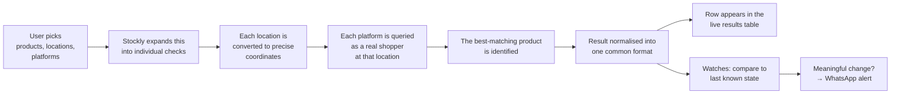

# Stockly — Product & Business Overview

> A non-technical companion to [`ARCHITECTURE.md`](./ARCHITECTURE.md). This
> document explains **what the product does, who it serves, what it can and
> cannot do, and what it costs to run.**

---

## 1. The problem

When someone wants to know whether a product is actually buyable right now, they
face a fragmented market. In India, a single product may be sold through eight
or more channels — quick-commerce apps that deliver in ten minutes, large
e-commerce marketplaces, and brand-owned stores — and **each one answers the
availability question differently**.

Three properties make this genuinely hard:

1. **Availability is local, not national.** Quick-commerce stock is tied to a
   specific dark store serving a specific pincode. A product in stock in
   Koramangala may be unavailable four kilometres away.
2. **There is no aggregated view.** Checking eight platforms across ten
   localities means eighty manual app searches, each requiring the delivery
   address to be changed first.
3. **Availability is volatile.** High-demand items — a new phone launch, a
   discounted appliance, a scarce grocery item — sell out in minutes. A manual
   check answers "was it available when I looked", not "is it available now".

The practical consequence is that anyone who needs a reliable answer resorts to
repetitive manual checking, and still misses restocks that happen overnight or
while they are busy.

## 2. What Stockly does

Stockly answers one question at scale:

> **"Is this product in stock, at what price, on which platform, near which
> pincode — right now?"**

It does this two ways:

- **On demand.** Ask once, across many products, locations and platforms at the
  same time, and get a single consolidated results table.
- **Continuously.** Register a product and location once, and get a WhatsApp
  message when something meaningful changes — it comes back in stock, or the
  price drops below a target.

The product's core value is **collapsing eighty manual checks into one query,
and then removing the need to check at all.**

---

## 3. Who it is for

Stockly is an **invite-only, admin-provisioned tool**, not a public consumer
app. There is no self-service signup: an administrator creates each account and
explicitly grants what that account may access. That shapes who it serves.

| User | What they need | How Stockly serves them |
|---|---|---|
| **Retail / category manager** | Where is our product actually on shelf, and at what price vs. competitors? | Multi-city, multi-platform sweeps with price and MRP captured per location |
| **Reseller / deal hunter** | Alert me the moment this hits my target price or restocks | Price-threshold and restock watches delivered to WhatsApp |
| **Operations / supply chain** | Which localities have gone out of stock? | Pincode-level availability map per platform |
| **Brand owner** | Are my listings live and correctly priced across channels? | Cross-platform listing and price verification |
| **Administrator** | Control cost and access | Per-user platform, city and pincode grants, plus a full search audit log |

The access model exists because **checking costs real resources**. Every check
is a live request to a retailer, so an unrestricted user can generate
significant load. Access grants are therefore a commercial control, not just a
security feature — see [§7](#7-access-control-as-a-commercial-control).

---

## 4. Coverage

Measured from the shipped `cities.json`:

| Dimension | Coverage |
|---|---|
| **Cities** | 21 |
| **States / UTs** | 13 |
| **Curated pincodes** | 775 |
| **Platforms** | 8 |
| **Custom pincodes** | Any valid 6-digit Indian pincode, if the user is permitted |

**Cities:** Ahmedabad, Bengaluru, Bhopal, Chennai, Delhi, Goa, Gurugram, Indore,
Jaipur, Kochi, Kolkata, Kollam, Kozhikode, Mumbai, Nagpur, Nashik, Noida, Pune,
Thiruvananthapuram, Thrissur.

Largest by pincode depth: Delhi (93), Bengaluru (92), Goa (85), Mumbai (82),
Nagpur (62), Pune (53).

### Platforms

| Platform | Segment | What availability means there |
|---|---|---|
| **Blinkit** | Quick commerce | Dark-store stock for the pincode, with live inventory count |
| **Swiggy Instamart** | Quick commerce | Store-level stock for the resolved store |
| **Zepto** | Quick commerce | Store-level stock, plus serviceability |
| **BigBasket** | Grocery | Dual catalogue — express (local) and marketplace (national) |
| **Flipkart Minutes** | Quick commerce | Hyperlocal store stock |
| **JioMart** | Grocery / general | Location-resolved catalogue |
| **Croma** | Electronics retail | National listing, confirmed against pincode deliverability |
| **Apple India** | Brand store | Delivery eligibility and store pickup for the pincode |

The mix is deliberate. Quick-commerce platforms answer *"can I get this in ten
minutes"*; Croma and Apple answer *"can this be delivered or collected here at
all"*. Covering both means one tool spans everyday groceries and high-value
electronics.

---

## 5. Features

### 5.1 Multi-dimensional availability search

The user selects any combination of **products × locations × platforms**, and
Stockly checks every combination. Locations can be chosen as whole cities
(expanding to that city's curated pincodes), as individually typed pincodes, or
both.

Results arrive **progressively** — rows appear as each check completes rather
than after the whole run finishes — so a long sweep is useful immediately.

Each result row reports: platform, pincode and resolved locality, matched
product name and variant, brand, current price, MRP, delivery ETA, remaining
inventory where the platform exposes it, and a map link to the exact checked
location.

### 5.2 Honest, four-way status reporting

This is a subtle feature that carries disproportionate business value. Stockly
never collapses availability to a yes/no. It distinguishes:

| Status | Business meaning |
|---|---|
| **Available** | In stock and buyable here |
| **Out of stock** | Listed here, currently unavailable |
| **Not found** | The platform has no matching product for this query |
| **Not serviceable** | The platform does not deliver to this pincode at all |
| **Error** | We could not get a reliable answer |

"Not serviceable" and "not found" are commercially different from "out of
stock" — the first two are distribution gaps, the third is an inventory gap.
Critically, **"error" is never reported as "out of stock"**, so a temporary
failure to check is never mistaken for a real market signal.

### 5.3 Runs that survive interruption

A large sweep can run for a long time. Runs execute on the server, independently
of the browser, so the user can close the tab, lock their phone, lose signal or
reload the page, then return and find the run still progressing with all results
intact. Results are never duplicated on reconnect.

A **Stop** control cancels a run promptly rather than waiting for the current
batch to finish.

### 5.4 Nearest-first results

When a user provides a reference location — their current position or a chosen
pincode — Stockly checks the closest pincodes first. On a large sweep the most
relevant answers arrive within the first few results instead of being buried
partway through.

### 5.5 Product picker

Free-text search is convenient but imprecise: "iphone 17" could match a case, a
charger, or several storage variants. The product picker shows the actual list
of items a platform returns for a query at a chosen location, so the user can
confirm they are tracking the exact item before committing to a watch.

### 5.6 Stock watches with WhatsApp alerts

The flagship feature. A user registers a product, one or more locations, and one
or more platforms. Stockly re-checks each on a configurable cadence (20 minutes
by default) and sends a WhatsApp message when something meaningful changes.

Four alert modes:

| Mode | Alerts when | Typical use |
|---|---|---|
| **Threshold** | In stock **and** at or below a target price | "Tell me when this drops to ₹14,300" |
| **Price drop** | In stock **and** cheaper than last seen | Track any downward price movement |
| **Availability** | Item returns to stock | Restock alerts for scarce items |
| **Change** | Any status change | Full monitoring of a volatile item |

Target prices can be set per product inline using an `@` suffix — for example
`oppo k14 6/128 @14300` — so a single submission can register many products with
different targets.

Two behaviours make alerts trustworthy in practice, and both are deliberate:

- **Alerts fire on transitions, not on states.** An item sitting in stock for a
  week produces one message, not one every twenty minutes.
- **Failed checks never trigger alerts.** If a platform blocks or times out,
  Stockly records the failure without changing the item's known state. Without
  this, every transient failure would produce a false "back in stock" alert on
  recovery, and users would learn to ignore the notifications.

WhatsApp was chosen as the delivery channel because it is where this audience
already is — no new app, no email filtering, and messages arrive on a locked
phone.

### 5.7 Export and reporting

Any results table exports to CSV for use in spreadsheets, pricing reviews or
reporting. Every search is recorded in an audit log visible to administrators,
showing who searched for what, where, and how many checks it consumed.

### 5.8 Administration

Administrators can create and deactivate users, set each user's platform, city
and pincode permissions, force password resets, review the search audit log, set
the global alert mode and check cadence, and link the WhatsApp sending account
by scanning a QR code in the browser.

### 5.9 Mobile app

An Expo / React Native client provides the core check-and-view workflow on
phones, pointed at the customer's own server instance. See
[§10](#10-current-limitations) regarding its current status.

---

## 6. How it works, in business terms

The essential mechanic is that Stockly **queries each platform exactly as a
shopper in that locality would**, then translates eight different answers into
one consistent format. Retailers do not offer availability data feeds, so the
only way to know what a customer in a given pincode sees is to look at what that
customer would see.

Two supporting capabilities make this reliable:

- **Location resolution.** Pincodes are converted to precise coordinates and
  cached permanently, so repeat checks incur no lookup delay.
- **Product matching.** Free-text queries are matched against each platform's
  catalogue with rules that understand accessories and capacity variants — so
  "iphone 17" does not match an iPhone 17 case, and a 128GB query prefers the
  128GB variant.

---

## 7. Access control as a commercial control

Because every check consumes real resources, permissions are the throttle. Each
account carries three independent grants:

| Grant | Controls | Commercial purpose |
|---|---|---|
| **Platforms** | Which of the 8 are available | Restrict to relevant channels |
| **Cities** | Which cities may be selected | Bound the search space |
| **Custom pincodes** | May the user type arbitrary pincodes? | Prevent unbounded usage |

The third matters most. A user limited to one city has a naturally bounded
workload; a user who can paste arbitrary pincode lists can trigger effectively
unlimited checking. This makes it straightforward to offer tiered access — for
example a single-city account for a regional team versus an unrestricted account
for a national one — without any billing system.

All grants are enforced on the server, so restrictions cannot be bypassed by
manipulating the app.

---

## 8. Capacity and realistic expectations

**This is the most important operational section.** Checks are live requests to
real retailers and must be paced to avoid being blocked, so throughput is
deliberately limited. Planning a deployment without understanding this leads to
disappointment.

Checks run largely sequentially within a run. Fast platforms with direct data
access complete in a few seconds; platforms requiring a full browser take
appreciably longer. **A blended average of roughly ten seconds per check** is a
reasonable planning figure.

### On-demand searches

| Scope | Checks | Rough duration |
|---|---:|---|
| 1 product, 1 platform, 1 pincode | 1 | seconds |
| 1 product, 1 platform, one city (~90 pincodes) | ~90 | ~15 minutes |
| 1 product, all 8 platforms, one city | ~720 | ~2 hours |
| 1 product, all 8 platforms, all 775 pincodes | 6,200 | impractical |

**The practical guidance is to scope searches deliberately.** Stockly is built
for targeted questions — one product across one city's pincodes, or a handful of
products across a chosen shortlist. Exhaustive national sweeps are not a
realistic use of the current system. Nearest-first ordering exists precisely so
that a broad search still delivers its most useful results early, even if the
user stops it before completion.

### Watches

Watches are processed sequentially by a single background process with
deliberate pauses between checks. At the default 20-minute cadence, a practical
ceiling is **roughly 100 active watches**, and lower if many target the most
aggressively rate-limited platforms.

To monitor more, the options are to lengthen the cadence (60 minutes roughly
triples capacity), narrow watches to fewer platforms, or run additional
instances. Capacity scales with cadence, and this trade is the main lever
available.

---

## 9. Operating model and costs

Stockly is designed to be **self-hosted and inexpensive**, and the technology
choices consistently favour zero marginal cost.

| Component | Choice | Cost |
|---|---|---|
| Hosting | Single small VPS or EC2 instance | ~$5–20/month |
| Database | Embedded, file-based | Free |
| WhatsApp delivery | Self-hosted bridge using an ordinary WhatsApp account | Free |
| Location lookups | Public geocoding, cached permanently | Free |
| Network egress | Home internet tunnel, or a commercial proxy | Free, or ~$10–50/month |

Total realistic running cost is **roughly $5–20 per month**, with no per-check,
per-message or per-user fees. There are no third-party API contracts, no
per-seat licensing, and all data stays on infrastructure the operator controls.

### The egress consideration

One operational nuance is worth understanding because it affects deployment
choice. Several grocery platforms **block traffic originating from cloud data
centres**. Hosted on a standard cloud server, those platforms return errors
regardless of how well the software behaves.

Two options resolve this:

1. **A commercial residential proxy** — reliable, roughly $10–50/month.
2. **A secure tunnel through the operator's own home internet connection** —
   free, and included in the deployment tooling. The trade-off is a dependency
   on a home machine and connection remaining online.

Most small deployments use the second and pay nothing. Business-critical
deployments should budget for the first.

### Deployment

The system installs on a fresh server with a single command that provisions
everything, generates its own credentials, and can obtain an HTTPS certificate
automatically for a supplied domain. Day-to-day operation requires no
intervention beyond periodic maintenance (see below).

---

## 10. Current limitations

Stated plainly, because they affect purchasing and planning decisions.

**Throughput is the primary constraint.** See [§8](#8-capacity-and-realistic-expectations).
Stockly answers targeted questions well; it is not a national market-scanning
platform in its current form.

**Scraping requires ongoing maintenance.** Availability is read from live
consumer-facing systems. When a retailer redesigns its site or changes its
defences, the corresponding integration can break and needs repair. This is
inherent to the category, not a defect — but it means **Stockly requires an
owner**, not merely a server. Expect occasional maintenance across eight
integrations. Breakage typically shows as a platform reporting "not found" for
products it should have; there is currently no automatic alerting for this, so
periodic spot-checks are advisable.

**Product matching is heuristic.** Free-text matching is very good but not
infallible, particularly for products with many near-identical variants. The
product picker exists to remove this ambiguity for anything being watched
long-term, and should be used for high-value tracking.

**Single-instance design.** One server, one database file, one WhatsApp
connection. This is appropriate at the current scale but means there is no
automatic failover. Regular backups of the data file are essential and are
currently a manual responsibility.

**The mobile app is behind the web app.** It supports checking and viewing
results but not watches or administration, and it currently requires an update
to work against the latest server version. **The web application is the
complete product today** and works well on mobile browsers.

**Legal and terms-of-service considerations.** Stockly retrieves publicly
visible information from retailer websites in the same way a shopper's browser
would, but this may sit outside those retailers' terms of service. Any
commercial or large-scale deployment should be reviewed against the relevant
terms and applicable law. Conservative pacing reduces the burden placed on
retailer systems, and staying conservative is both the ethical and the practical
choice — aggressive use is also the fastest route to being blocked.

---

## 11. Where the product could go next

Ordered by business value rather than implementation effort.

1. **Price history and trend reporting.** Every check already captures a price;
   retaining that history would turn Stockly from a point-in-time checker into a
   competitive pricing dataset — arguably a larger opportunity than availability
   alone.
2. **Automatic detection of broken integrations.** Alerting when a platform's
   results become anomalous would remove the main hidden maintenance risk and
   substantially reduce the cost of ownership.
3. **Higher throughput.** Restructuring how checks are distributed would raise
   the practical ceiling and make broader sweeps viable, directly relaxing the
   most significant current constraint.
4. **Scheduled reports.** A recurring digest — "availability across our top 20
   pincodes, every Monday" — would serve category and operations teams without
   requiring them to log in.
5. **Additional channels.** Email, Slack or Telegram alongside WhatsApp, for
   teams rather than individuals.
6. **Feature parity on mobile.** Watch management and alert configuration in the
   app.

---

## 12. Summary

Stockly turns a tedious, error-prone manual process — checking product
availability across many platforms and localities — into a single query, and
then into an automated watch that reports only when something meaningful
changes.

Its distinguishing characteristics are **breadth** (eight platforms spanning
quick commerce, grocery, electronics retail and a brand store), **locality
precision** (pincode-level rather than national answers), **honest reporting**
(clear separation of out-of-stock, not-listed, not-serviceable and
could-not-check), and **very low operating cost** (self-hosted, no per-use fees).

Its principal constraints are **throughput**, which makes it well suited to
targeted questions rather than exhaustive national sweeps, and **maintenance**,
which is inherent to reading live retail systems and means the product needs an
active owner.

Used within those bounds, it delivers information that is not otherwise
obtainable from any single source.
